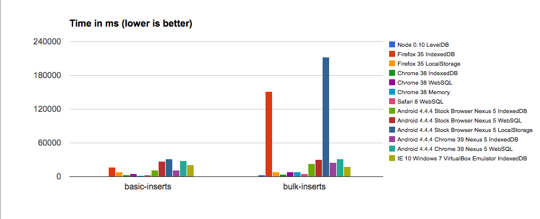
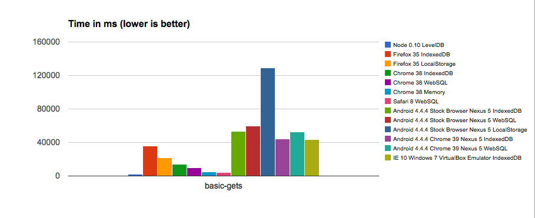
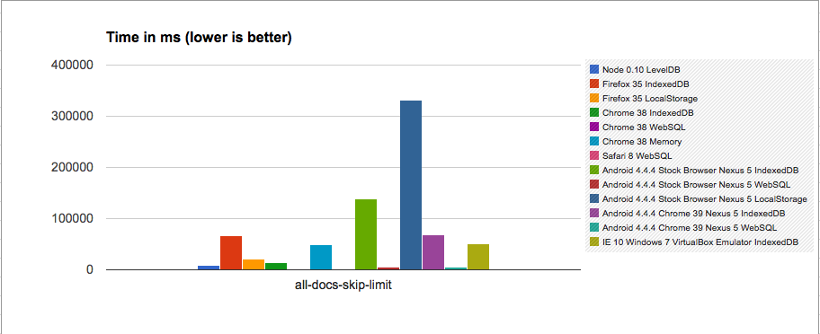
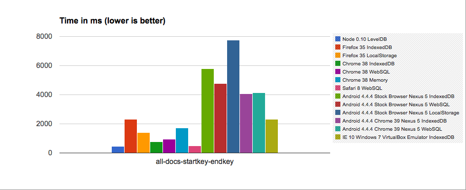
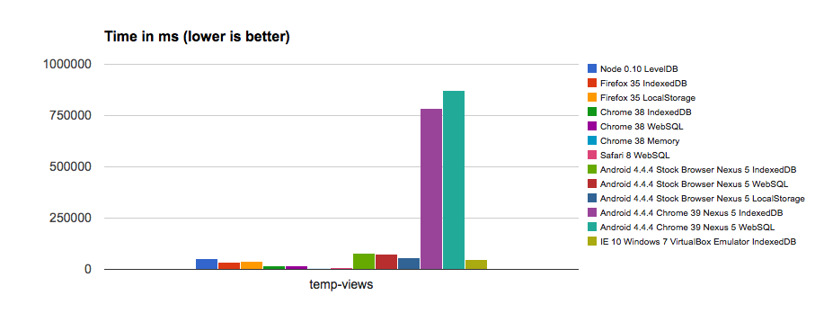
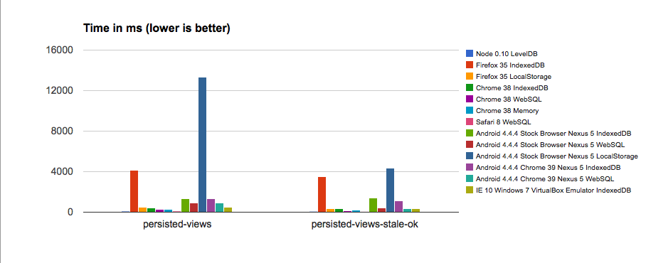

PouchDB Performance Report for v3.1.0, November 2014
===========

I put together another performance report. Here is [the data](https://docs.google.com/spreadsheets/d/1SNEDvnoy7K3DeQzi5GRdPN-PVIEl7XutjL8WOihuZlw/edit?usp=sharing).

All tests were performed on a 2013 MacBook Air running Yosemite, except those marked "Nexus 5," which were on a Nexus 5 running Android 4.4.4 (CyanogenMod 11). Internet Explorer was tested in VirtualBox.

Without further ado, feast your eyes on some charts. Takeaways are at the bottom.

### Charts

### My key takeaways

* I'm eating my words about how "WebSQL is always faster than IndexedDB." Chrome and Android's IndexedDB is actually smoking WebSQL in a lot of these tests.
* However, Safari 8's WebSQL is super fast. It barely even shows up on the charts. Wow wow wow.
* Firefox's IndexedDB is still the slowest, but it's not as bad as it used to be.
* LocalStorage and in-memory are fast, but not crazy fast.
* WTF happened with Chrome 39 on Android? It's even slower than the stock browser (Chrome 33).
* `temp-views` is a crazy test that really shows terrible performance in all browsers. That's understandable, given that it's testing the full process of building up an index as well as querying it. I think it should be our gold standard for performance improvements from now on, since it gives us the best granularity.
* `bulk-inserts` is often slower than `basic-inserts`. Not sure if it's an apples-to-apples comparison, but that's something to worry about.