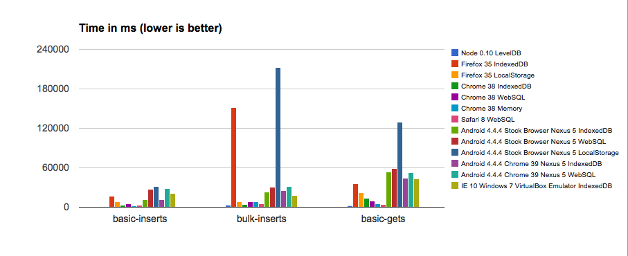

PouchDB Performance Report for v3.1.0, November 2014
===========

I put together another performance report. Here is [the data](https://docs.google.com/spreadsheets/d/1SNEDvnoy7K3DeQzi5GRdPN-PVIEl7XutjL8WOihuZlw/edit?usp=sharing).

All tests were performed on a 2013 MacBook Air running Yosemite, except those marked "Nexus 5," which used a Nexus 5 running Android 4.4.4 (CyanogenMod 11). Internet Explorer was tested in VirtualBox.

Without further ado, feast your eyes on some charts:

Some key takeaways:

* I'm eating my words about how "WebSQL is always faster than IndexedDB." IndexedDB is actually smoking WebSQL in a lot of these tests, even on mobile.
* LocalStorage and 